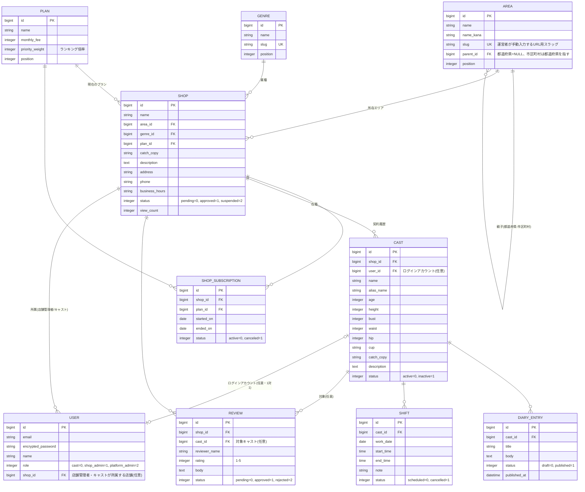

# ER図

## 補足

- `Shop`(店舗)と`Cast`(在籍キャスト)は1対多。実際のCityheavenと同様、
  1店舗に複数の女性キャストが在籍する構成。
- `User`は3ロール共通の1テーブルで、`shop_admin`/`cast`ロールの場合のみ`shop_id`を持つ。
  `Cast`から`User`への`user_id`は「そのキャスト本人のログインアカウント」を指す(店舗管理者が
  発行するかどうかは任意 = ログインアカウントを持たないキャストも許容)。
- `Review`は`shop_id`必須・`cast_id`は任意(店舗全体への口コミ/特定キャストへの指名口コミの両対応)。
- ランキングは `Shop.view_count × Plan.priority_weight` の掛け算スコアで簡易的に算出する
  (`app/models/shop.rb` の `ranked` スコープ)。
