# 運営者(プラットフォーム管理者)マニュアル

対象: `platform_admin` ロールのアカウントをお持ちの運営者向け。
管理画面URL: `/admin`(ログイン後は自動的にこちらへ移動します)

---

## 1. ログイン

`/users/sign_in` からメールアドレスとパスワードでログインしてください。ログイン後、自動的に運営管理画面(ダッシュボード)が表示されます。

パスワードを忘れた場合は、ログイン画面の「パスワードをお忘れですか?」からリセットできます(メール送信の設定が必要です)。

---

## 2. ダッシュボード

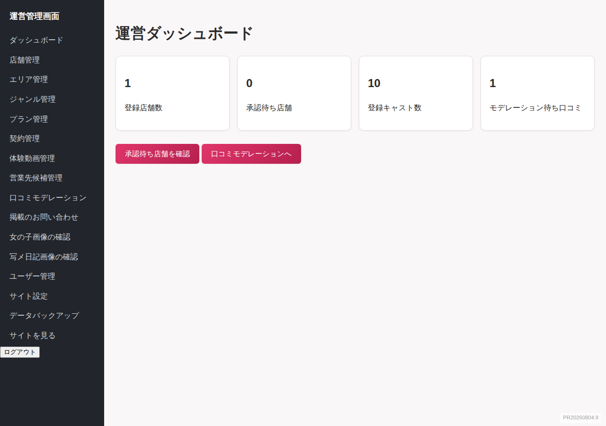

サイト全体の状況をひと目で確認できます。

- 登録店舗数
- 承認待ちの店舗数
- 在籍キャスト数
- モデレーション待ちの口コミ数

---

## 3. 店舗管理(左メニュー「店舗管理」)

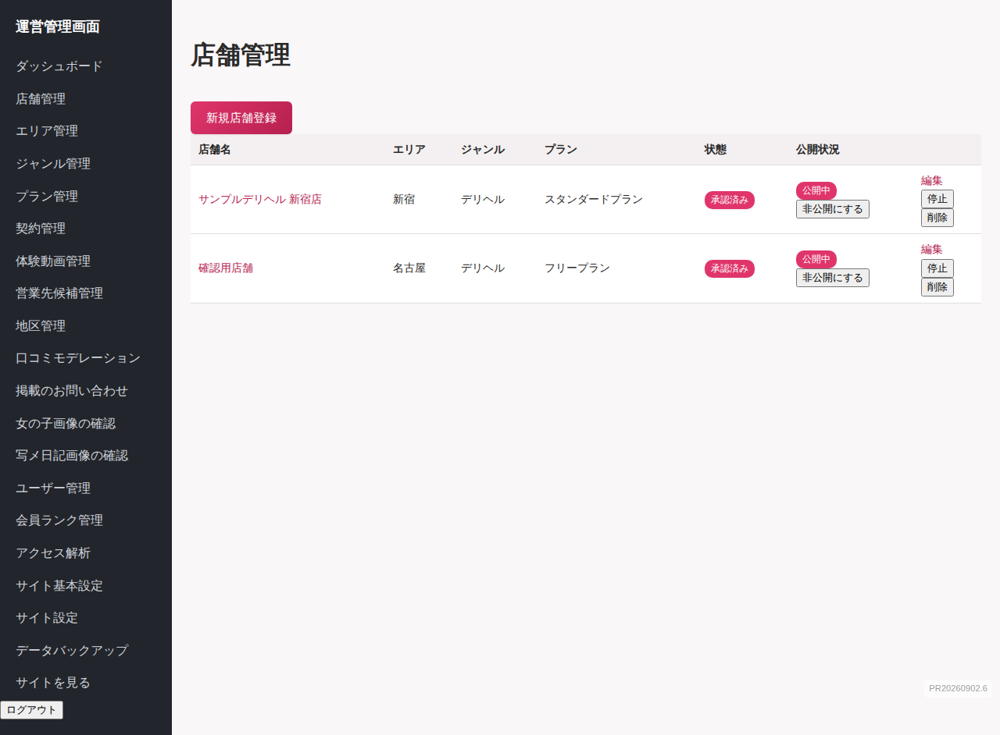

- **一覧**: 全店舗の状態(承認待ち/承認済み/停止中)を確認できます。
- **新規作成 / 編集**: 店舗名・エリア・ジャンル・プラン・チェーン名・編集部コメントなど、店舗管理者からは変更できない項目を設定します。
- **承認(approve)**: 新規申請の店舗を公開状態にします。
- **停止(suspend)**: 問題のある店舗を非公開にします(店舗管理者・キャストのログインは可能なままです)。
- **ページ構成(ブロック)を管理**: その店舗の店舗詳細ページのブロック構成を、店舗管理者に代わって編集できます(店舗管理者と同じ画面)。
- **女の子ページ構成(ブロック)を管理**: 同様に、キャスト詳細ページの共通ブロック構成を編集できます。
- **返信テンプレートを管理**: その店舗の口コミ返信テンプレートを代理で登録・編集できます。
- **アカウントを作成する**(店舗詳細画面): その店舗の店舗管理者アカウントをすぐに作成できるショートカットです(下記「10. ユーザー管理」に続きます)。
- **店舗運営状況を見る**: 店舗詳細画面の下部に、その店舗管理者が普段使っている各機能を運営者側から横断的に確認・操作できるリンクがあります。いずれも店舗管理者と同じ内容を、代わりに登録・編集・削除できます(店舗管理者マニュアルの該当セクションも参照してください)。
  - **在籍キャスト**: 新規登録・プロフィール編集・削除・ログインアカウント発行(店舗管理者マニュアル「4. 在籍キャスト管理」)
  - **クーポン**: 新規登録・編集・削除・利用実績の手動記録(同「11. クーポン管理」)
  - **出勤予定**: 画面での一括登録・CSV一括登録・個別削除(同「9. 出勤予定一括登録」)
  - **写メ日記**: 一覧・本文の閲覧に加え、**削除(モデレーション)**が行えます。新規作成・編集はキャスト本人のみの設計のため対象外です。
  - **プレゼント企画**: 新規登録・編集・削除・抽選する・当落メールを送信する(同「10. プレゼント企画管理」。抽選は一度実行すると取り消せません)
  - **会員ランク・特典**: ランクの新規登録・編集・削除、特典(割引券/無料券)の追加・編集・削除(同「12. 店舗会員証管理」)
  - **店舗会員証**: 会員ごとのランク・来店回数・ポイント残高に加え、利用履歴(来店)の記録・ポイント利用の記録・特典の利用済み化・事故歴/注意点の編集ができます(店舗内共有専用のメモも運営者は編集できます)

---

## 4. エリア管理(左メニュー「エリア管理」)

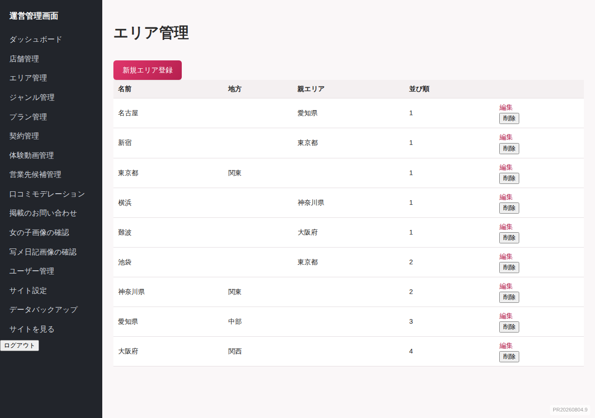

都道府県・市区町村のCRUDです。都道府県には「地方」(関東・中部など)を設定する必要があります。市区町村は都道府県を親として登録してください。表示順(position)とスラッグ(URLに使う半角英数字)も設定します。

現在サイトで公開しているのは「関東」「中部」の2地方のみです(`Area::ACTIVE_REGIONS`)。他の地方を追加しても、TOPページ・地域選択画面には表示されません。

まとめて登録したい場合は、画面上部の「CSVテンプレートをダウンロード」からひな形をダウンロードし、必要な行を追記してアップロードすると一括登録できます。都道府県の行は「親エリアのスラッグ」を空欄にし、市区町村の行はその都道府県の行より後ろに置いてください(親を先に登録しておく必要があります)。1行ごとに登録の成否を判定し、エラーがあった行だけスキップして結果を画面上部に表示します。「登録済みのエリアをCSVダウンロード」から、現在登録されている内容をCSVで書き出すこともできます。

---

## 5. ジャンル管理(左メニュー「ジャンル管理」)

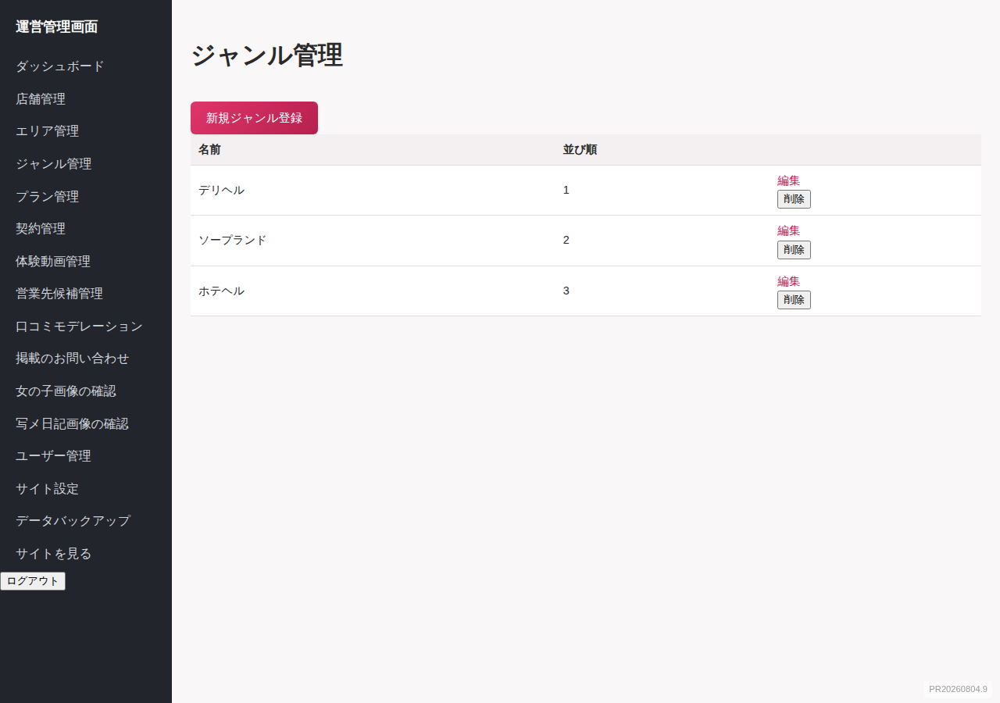

デリヘル・ソープなど、業態ジャンルのCRUDです。表示順・スラッグを設定します。

エリア管理と同様、「CSVテンプレートをダウンロード」からひな形を取得してアップロードすれば一括登録でき、「CSVダウンロード」で現在の登録内容を書き出せます。

---

## 6. プラン管理・契約管理

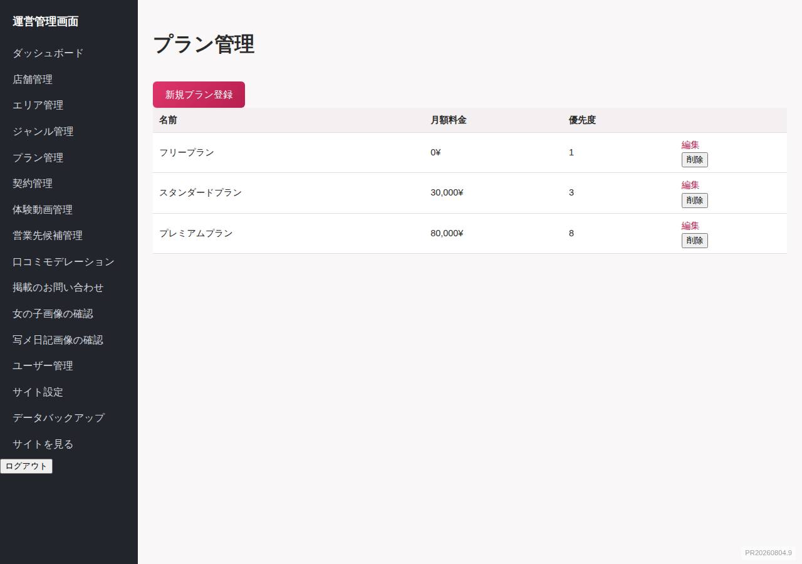

- **プラン管理**: 掲載プラン(月額料金・ランキング優先度の重み)のCRUD。CSVテンプレートをダウンロードしてアップロードすれば一括登録でき、CSVダウンロードで現在の登録内容を書き出せます。
- **契約管理**: 店舗とプランの契約履歴のCRUD。

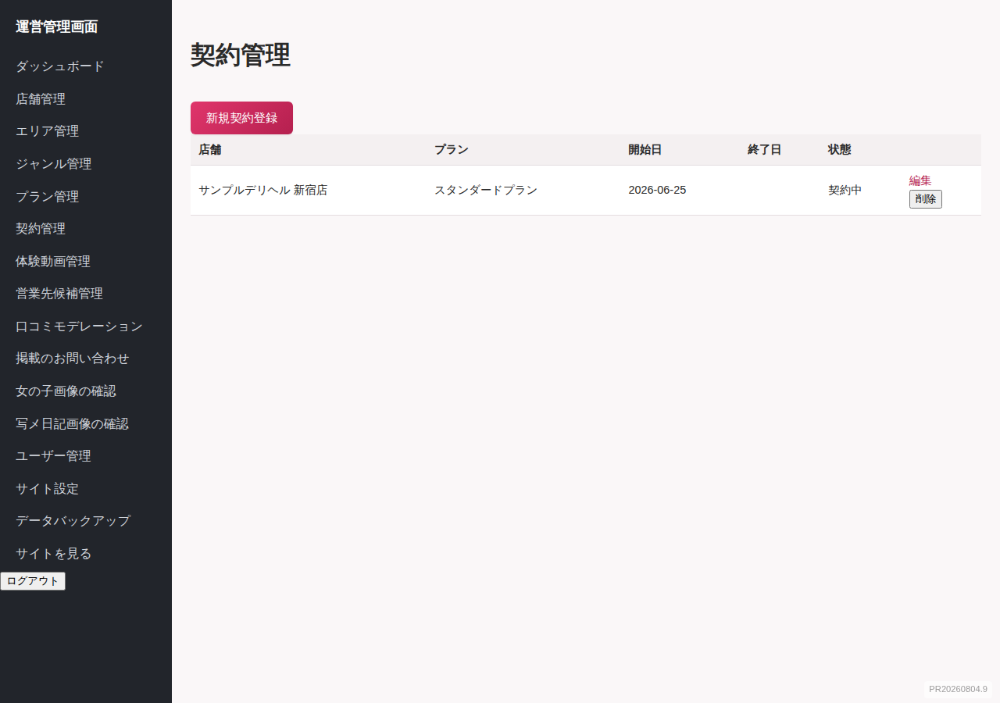

---

## 7. 体験動画管理(左メニュー「体験動画管理」)

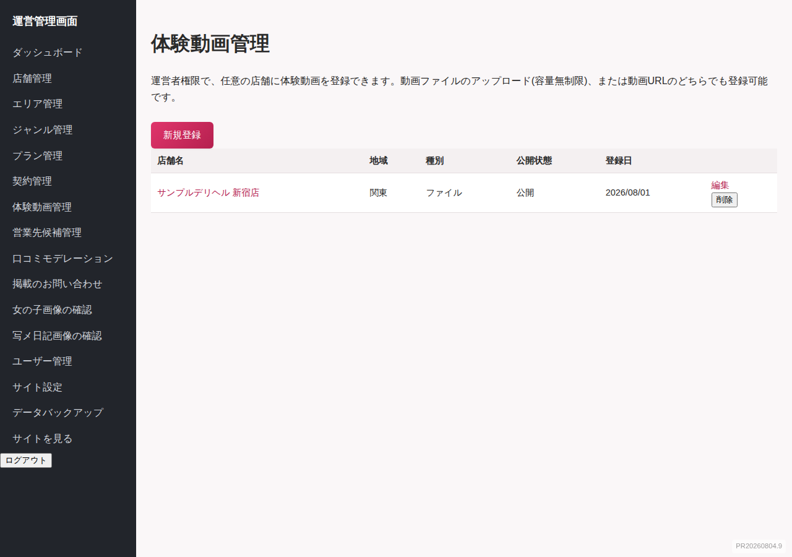

全店舗を横断して、体験動画(キャスト詳細ページ等に埋め込む動画)を登録・編集・削除できます。店舗ごとのページ構成(ブロック)管理画面を開かなくても、この画面から直接どの店舗にでも動画を追加できるショートカットです。

- **一覧**: 登録済みの動画を店舗・エリアとともに新しい順に確認できます。
- **新規登録**: 対象の店舗を選び、タイトル・動画ファイルを指定して登録します。
- **編集**: タイトルや表示/非表示、動画ファイルの差し替えができます(ファイルを選び直さなければ既存の動画はそのまま残ります)。
- **削除**: 動画を削除します。

ここで登録した動画は、店舗管理者の「ページ構成(ブロック)管理」にも動画ブロックとして表示されます(同じデータを共有しています)。

---

## 8. 営業先候補管理(左メニュー「営業先候補管理」)

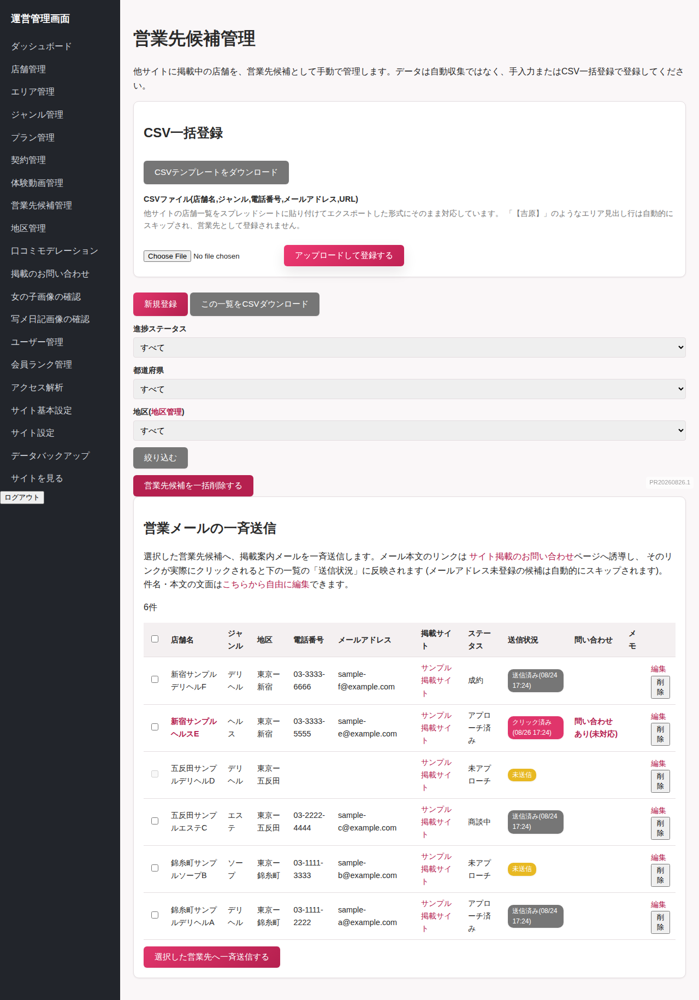

他の掲載サイトに掲載されている店舗を、新規営業先の候補として管理するための機能です。**このサイトに実際に掲載されている店舗(店舗管理)とは別物**です。

- **一覧**: 候補の一覧をステータス(未接触/接触済み/交渉中/成約/失注)で絞り込んで確認できます。
- **新規登録・編集・削除**: 店舗名・ジャンル・電話番号・メールアドレス・掲載元サイト名・掲載URL・ステータス・メモを管理します。
- **CSV一括登録**: 「テンプレートをダウンロード」で入力用のCSV雛形を取得し、必要事項を入力したファイルを「CSVから登録」でアップロードすると、まとめて登録できます。標準の列は **店舗名,ジャンル,電話番号,メールアドレス,URL** の5列です(ジャンルは「デリヘル/新宿・歌舞伎町」のように業種とエリアをまとめた自由記述)。他サイトの店舗一覧をスプレッドシートにコピー&ペーストしてエクスポートした形式にそのまま対応しており、「【吉原】」のようなエリア見出し行は自動的にスキップされ、営業先として登録されません。形式に合わない行はエラーとしてスキップされ、件数が結果画面に表示されます。
- **営業メールの一斉送信**: 一覧の左端のチェックボックスで送信先を選び(見出し行のチェックボックスで全選択/解除)、「選択した営業先へ一斉送信する」で掲載案内メールを一斉送信できます。メールアドレス未登録の候補はチェックボックスが選択不可になっており、自動的にスキップされます。
  - メール本文のリンクは「サイト掲載のお問い合わせ」ページへ誘導します。自社サイトの独自の登録フォームがあるわけではなく、公開サイトの問い合わせフォームに繋がる形です。
  - 「送信状況」列で、候補ごとに **未送信 / 送信済み(送信日時) / クリック済み(クリック日時)** が確認できます。クリック済みは、メール内のリンクが実際にクリックされたことを示す最も強い反応シグナルです。
  - 同じ候補に再送信すると、送信日時は上書きされます(クリック済みの記録は保持されます)。
  - メールの件名・本文は「こちらから自由に編集」リンク(営業先候補管理画面内)から自由に書き換えられます。本文には `%{name}`(店舗名)・`%{listing_site_name}`(掲載サイト名)・`%{registration_url}`(クリック計測付きの案内リンク、**必須**)のプレースホルダーが使え、送信時に候補ごとの内容へ自動的に置き換わります。`%{registration_url}` を含めずに保存しようとするとエラーになります。

---

## 9. 口コミモデレーション(左メニュー「口コミモデレーション」)

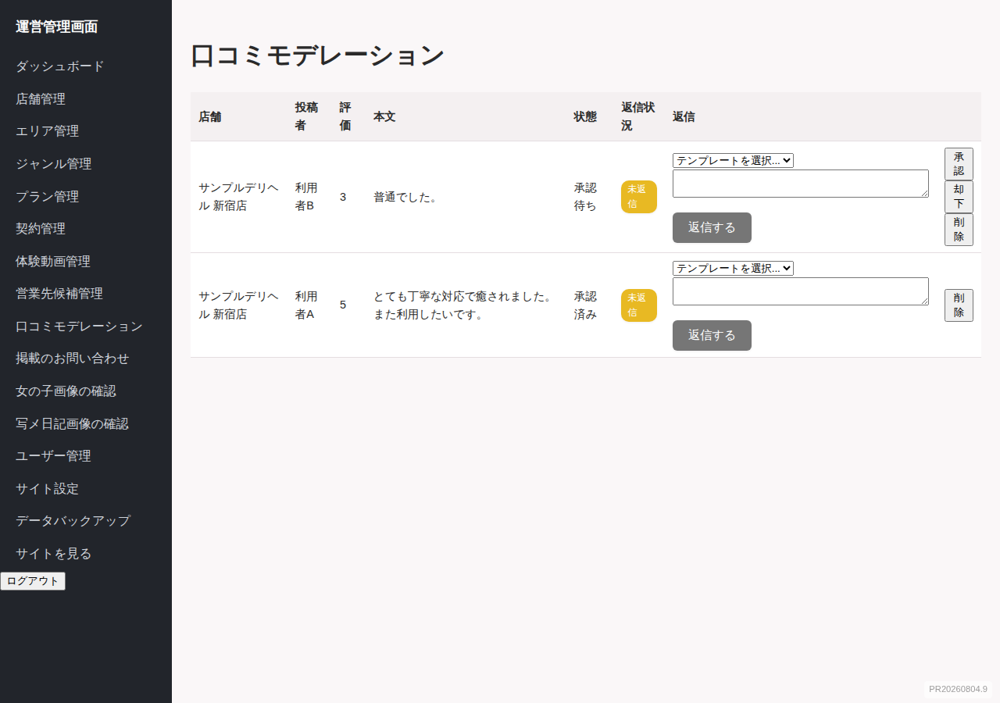

- 投稿された口コミの一覧を確認できます。
- **承認**: 一般公開します。
- **却下**: 非公開のままにします。
- **削除**: 口コミ自体を削除します。
- **返信**: 各口コミに運営者として直接返信できます(店舗管理者だけでなく運営者からも返信可能)。返信欄には、その店舗に登録済みの返信テンプレートがあればプルダウンから選んで自動入力できます。

---

## 10. ユーザー管理(左メニュー「ユーザー管理」)

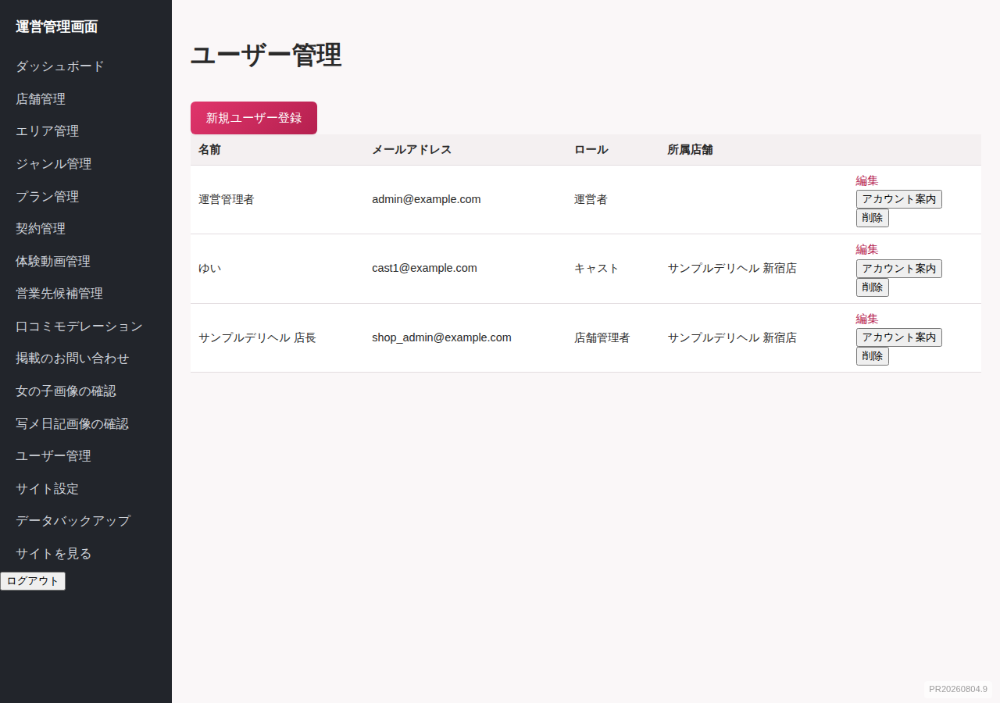

全ロール(運営者・店舗管理者・キャスト)のアカウントをCRUDできます。

- **新規作成**: 名前・メールアドレス・パスワード・ロール・(店舗管理者/キャストの場合)所属店舗を指定して作成します。
- **アカウント設定リンクを発行**: パスワードをその場で決めずに、相手が自分でパスワードを設定できる専用リンクを発行できます。発行されたURLをコピーして、相手に直接お伝えください(**メールは自動送信されません**)。

なお、店舗管理者が「在籍キャスト管理」からキャストを新規登録する際にも、その場でキャスト用ログインアカウント(メール・パスワード)を同時に発行できます(この場合は運営者の操作は不要です)。

---

## 11. 画像・動画モデレーション

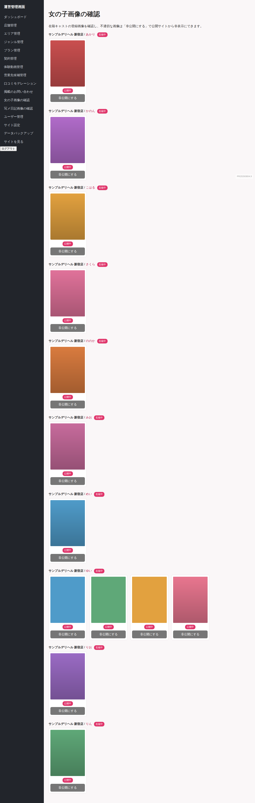

- **女の子画像の確認**(左メニュー「女の子画像の確認」): 全店舗のキャスト写真を横断的に確認し、不適切な画像を個別に「非公開」にできます(キャスト自体は削除されません)。
- **写メ日記画像の確認**(左メニュー「写メ日記画像の確認」): 写メ日記に添付された画像・動画を確認し、個別に非公開にできます。

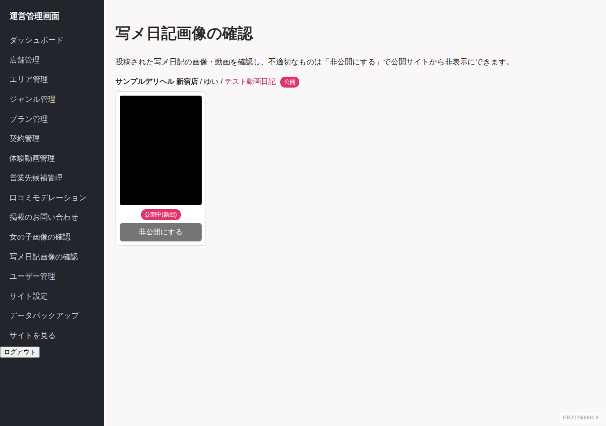

非公開にした画像・動画の代わりには、後述の「サイト設定」で指定した差し替え画像が表示されます。

---

## 12. お問い合わせ管理(左メニュー「掲載のお問い合わせ」)

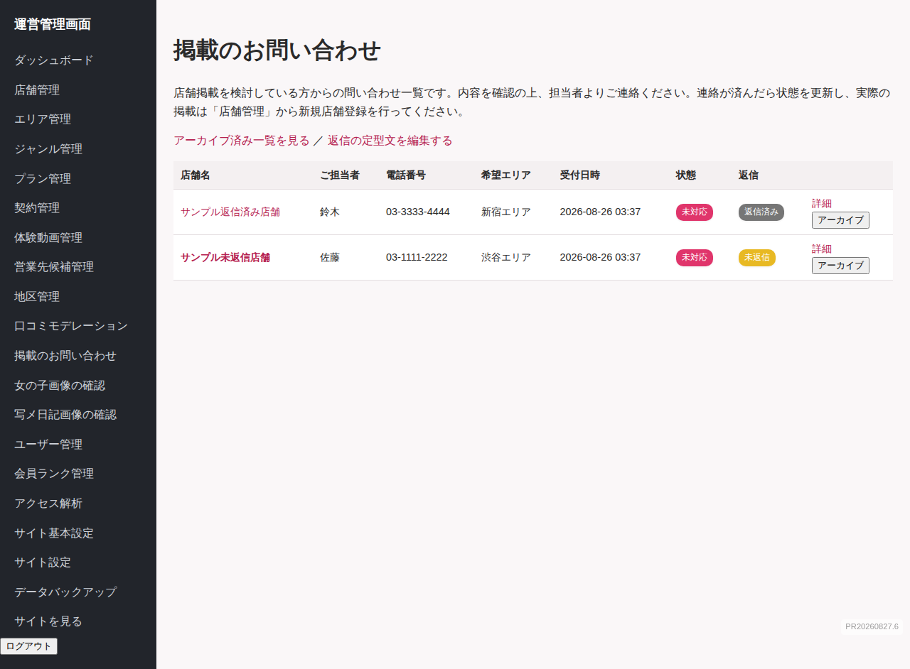

一般公開ページの掲載問い合わせフォームから届いた問い合わせの一覧・詳細を確認し、対応状況(未対応/対応中/対応済み)を更新できます。

---

## 13. サイト基本設定(左メニュー「サイト基本設定」)

サイト全体で使う基本画像はすべてこの1画面に集約されています。「どこで基本画像を登録するのか分からない」ときはまずここを確認してください。

- **Now Printing画像**: 写真が未登録の箇所に表示する画像(縦長・横長)。
- **サイトロゴ**: ヘッダー・SNSシェア画像・ファビコン用のロゴ(横長・スクウェア大・スクウェア小)。
- **削除された画像・動画の差し替え画像**: モデレーションで非公開にした画像・動画の代わりに表示する画像(縦長・横長)。
- **Indexページ画像**: TOPページの前に表示される案内(Index)ページのアイキャッチ画像と、関東/中部を選ぶ地図画像。
- **会員証イメージ(基本デザイン)**: 会員登録を済ませた個人会員のマイページに表示される、会員証の基本デザイン画像。未設定の場合は会員証セクション自体が表示されません。会員ランクごとに個別のカード画像(「会員ランク管理」の各ランク編集画面で設定)がある場合はそちらが優先され、この基本デザインはランクに画像が未設定の会員に使われます。

いずれも画像を選択せず保存すると、現在設定済みの画像は変更されません。

---

## 14. サイト設定(左メニュー「サイト設定」)

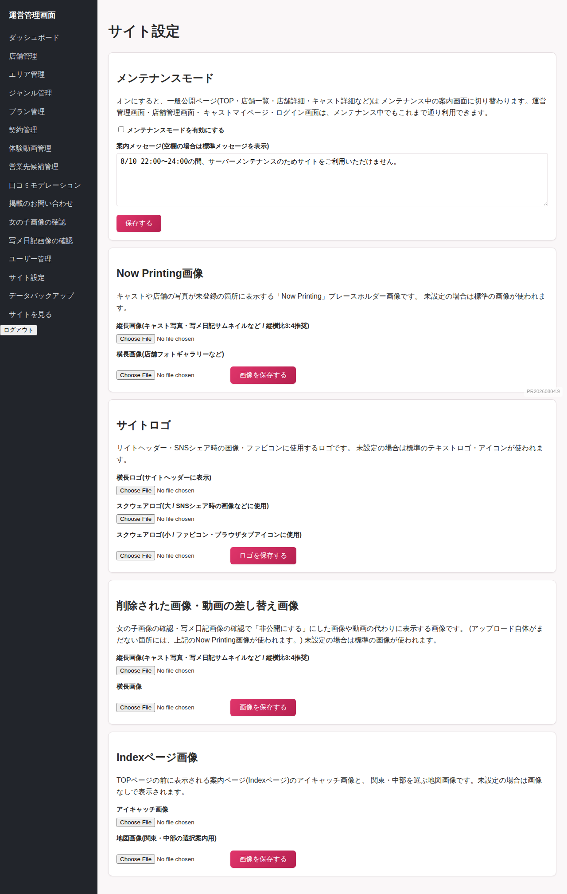

- **メンテナンスモード**: オンにすると一般公開ページがメンテナンス案内に切り替わります(運営管理画面・店舗管理画面・キャストマイページ・ログイン画面・掲載のお問い合わせページは影響を受けず、これまで通り利用できます)。
  - **案内メッセージ**: メンテナンス中の案内文を自由に編集できます。空欄の場合は標準メッセージが表示されます。
  - **メンテナンス画像**: 任意で画像をアップロードでき、設定すると案内メッセージの代わりに表示されます(文字ではなく画像でメンテナンス中である旨を伝えたい場合に使用します)。
  - **サイト掲載のお問い合わせバナー**: 任意で画像をアップロードでき、設定するとクリックで「サイト掲載のお問い合わせ」ページ(`/shop_inquiries/new`)へ移動するバナーとして表示されます。バナー画像を設定しない場合は、代わりにテキストリンクが表示されます。メンテナンス中でも店舗様からの掲載問い合わせだけは受け付けられるようにするための機能です。

基本画像のアップロードは上記「サイト基本設定」で行います。

---

## 15. データバックアップ(左メニュー「データバックアップ」)

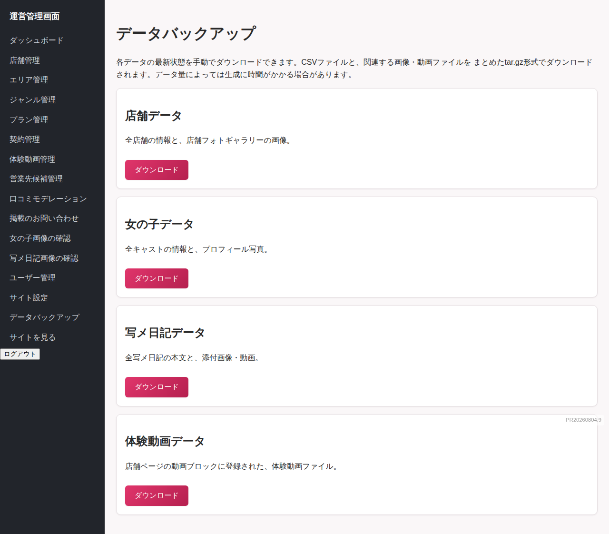

管理画面から手動で、以下の4種類のデータをまとめてダウンロードできます(CSV+添付ファイルのtar.gz形式)。

- 店舗データ
- 女の子データ
- 写メ日記データ
- 体験動画データ

これとは別に、サーバー側では毎日自動でデータベース全体のバックアップが作成され、7日分保持されます(VPS内、`backups/`フォルダ)。これは開発者がサーバーにログインして操作するもので、この管理画面からは操作できません(誤操作防止のためです)。

---

## 16. 会員ランク管理(左メニュー「会員ランク管理」)

個人会員(サイト閲覧者)向けの会員ランクを設定できます。

- ランク名と「必要承認数」(承認済み口コミ何件からそのランクになるか)を登録します。
- 会員は自分が投稿し、運営者に承認された口コミの件数に応じて、自動的にランクが付与されます(承認待ち・却下の口コミはカウントされません)。
- 付与されたランクは、会員マイページと、口コミ一覧の投稿者名の横にバッジとして表示されます。
- 複数のランクを登録した場合、条件を満たすもののうち必要承認数が最も高いランクが表示されます。
- 他の管理画面と同様、「CSVテンプレートをダウンロード」からひな形を取得してアップロードすれば一括登録でき、「CSVダウンロード」で現在の登録内容を書き出せます。
- ランクごとに「カード画像」(会員証のベースデザイン)を登録できます。会員証は、その会員の現在のランクに設定されたカード画像を優先して背景に使用し、ランクに画像が未設定の場合はサイト基本設定の会員証イメージ(共通デザイン)にフォールバックします。ランクをまたぐと会員証の見た目が自動的に切り替わります。
  - 画像を差し替えたい場合は、編集画面で新しい画像を選択して保存するだけで入れ替わります(古い画像は自動的に置き換わります)。
  - 画像を削除してサイト共通デザインに戻したい場合は、編集画面の「現在の画像を削除する」にチェックを入れて保存します。
  - 会員証は、会員マイページと店舗会員証の詳細画面の両方で、背景画像の上に店舗名・会員名・会員番号・発行日を重ねて表示されます(会員が店舗会員証に登録している店舗ごとに1枚ずつ表示されます)。カード下部には半透明の暗いパネルを敷いた上に文字を重ねるため、背景画像自体にサンプル文字やロゴが印刷されていても、実際の会員情報の文字が隠れたり二重に見えたりしません。

---

## 17. アクセス解析(左メニュー「アクセス解析」)

店舗詳細ページ・女の子詳細ページそれぞれの閲覧数を確認できます。画面上部の「店舗ページ」「女の子ページ」タブで切り替えます。

- 直近30日間の日別推移グラフ(全店舗合計 or 全女の子合計)と、閲覧数の多いランキング(上位10件)を表示します。
- ランキングの店舗名・女の子の名前をクリックすると、その店舗/女の子単体の日別推移に絞り込めます。絞り込み中はランキング表は表示されません。
- ランキング表の「閲覧数(累計)」はサービス開始からの合計閲覧数、「閲覧数(直近30日)」は表示中の期間内の閲覧数です。
- グラフの棒にカーソルを合わせると、その日の正確な閲覧数がツールチップで表示されます。
- 閲覧数は、一般ユーザーが実際に店舗詳細ページ・女の子詳細ページを開くたびに自動的に記録されます(手動での記録・修正はできません)。

---

## 18. 困ったときは

- 管理画面にログインできない → 開発担当者に連絡し、対象アカウントのメールアドレスを確認のうえパスワードリセットを依頼してください。
- 画像がアップロードできない(413エラーなど) → サーバー側の設定(Nginxのアップロード上限など)の調整が必要な場合があります。開発担当者に連絡してください。
