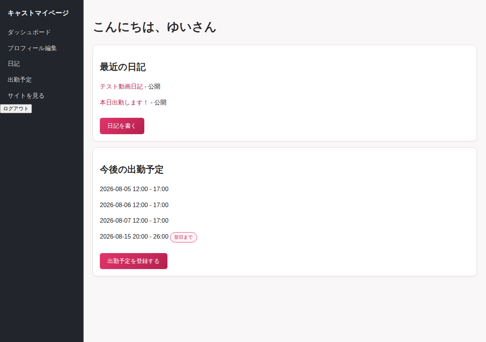
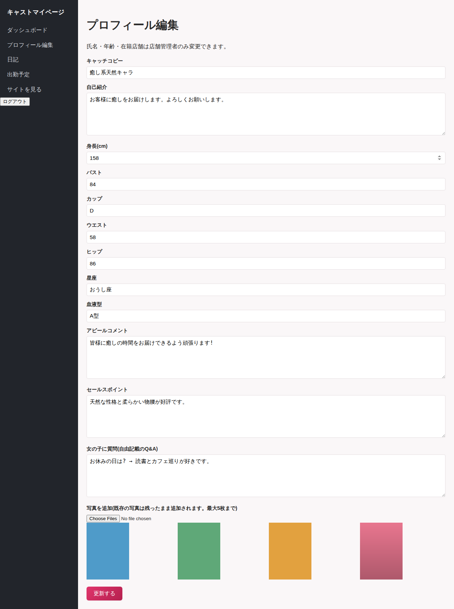
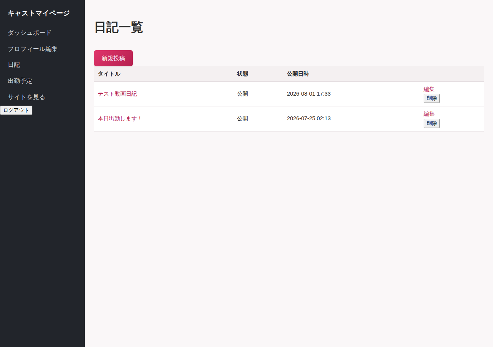
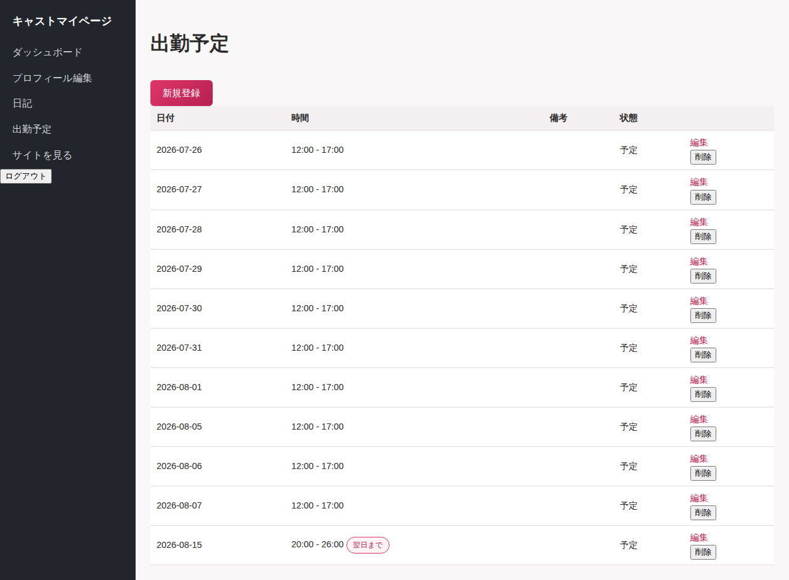

# キャスト(女の子)マニュアル

対象: `cast` ロールのアカウントをお持ちの方向け。
マイページURL: `/cast`(ログイン後は自動的にこちらへ移動します)

---

## 1. ログイン

`/users/sign_in` からメールアドレスとパスワードでログインしてください。ログイン後、自動的にマイページ(ダッシュボード)が表示されます。

アカウントは、所属店舗の店舗管理者が発行します。ログイン情報が分からない場合は、所属店舗の担当者にお問い合わせください。

もしまだアカウントに所属プロフィールが紐付いていない場合、マイページの一部機能は使えません。その場合も店舗管理者にお問い合わせください。

---

## 2. ダッシュボード

最近投稿した写メ日記と、直近の出勤予定のサマリが表示されます。

---

## 3. プロフィール編集(左メニュー「プロフィール編集」)

以下の内容を編集できます。

- キャッチコピー・自己紹介文
- 身長・バスト・ウエスト・ヒップ・カップサイズ
- アピールコメント・セールスポイント・Q&A用のメッセージ
- 星座・血液型
- プロフィール写真(追加方式で最大5枚までアップロード可能。既存の写真は残ったまま追加されます)

**氏名・年齢・所属店舗は自分では変更できません。** 変更が必要な場合は店舗管理者にご相談ください。

---

## 4. 写メ日記(左メニュー「日記一覧」)

- **投稿**: タイトル・本文・画像(最大5枚)・動画(1本)を登録できます。ステータスは「下書き」「公開」から選べ、公開日時も指定できます。
- **AIによる下書き作成**: 投稿・編集画面の「AI下書き作成」欄に書きたい内容の指示(例:「今日のお仕事について、明るいトーンで」)を入力すると、AIが本文の下書きを自動生成します。**そのまま投稿されるわけではなく、必ず内容を確認・編集してから保存してください。**
- **編集・削除**: 自分の投稿のみ操作できます。

写メ日記は、店舗ページ・自分のキャストページの両方にある「写メ日記」ブロックに反映されます。

---

## 5. 出勤予定(左メニュー「出勤予定」)

自分の出勤予定を登録・編集・削除できます。日付・開始時刻・終了時刻を入力してください。日をまたぐ出勤(深夜〜翌朝など)は「翌日にまたぐ」にチェックを入れてください。

登録した出勤予定は、店舗ページの「週間出勤」ブロックや、サイト全体の「本日の出勤一覧」ページに反映されます。

ステータスを「キャンセル」にすると、出勤予定は公開されません(削除ではなく非表示になります)。

---

## 6. 困ったときは

- ログインできない/パスワードを忘れた → 所属店舗の店舗管理者にご連絡ください。
- 写真や日記が公開画面に表示されない → 運営者による画像モデレーションで非公開に設定されている可能性があります。心当たりがある場合は所属店舗にご確認ください。
- プロフィールが登録されていないと表示される → 店舗管理者にアカウントとプロフィールの紐付けを確認してもらってください。
