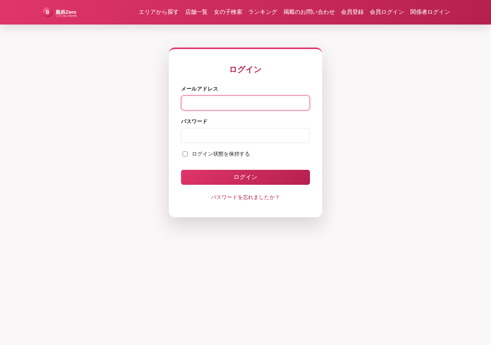
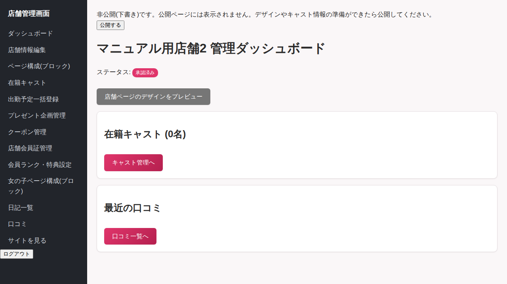
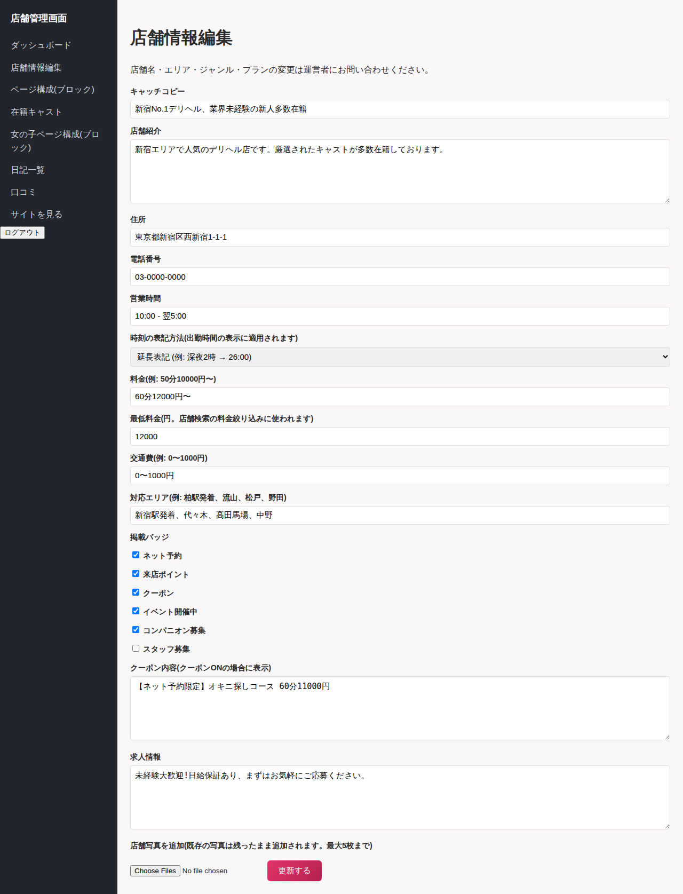
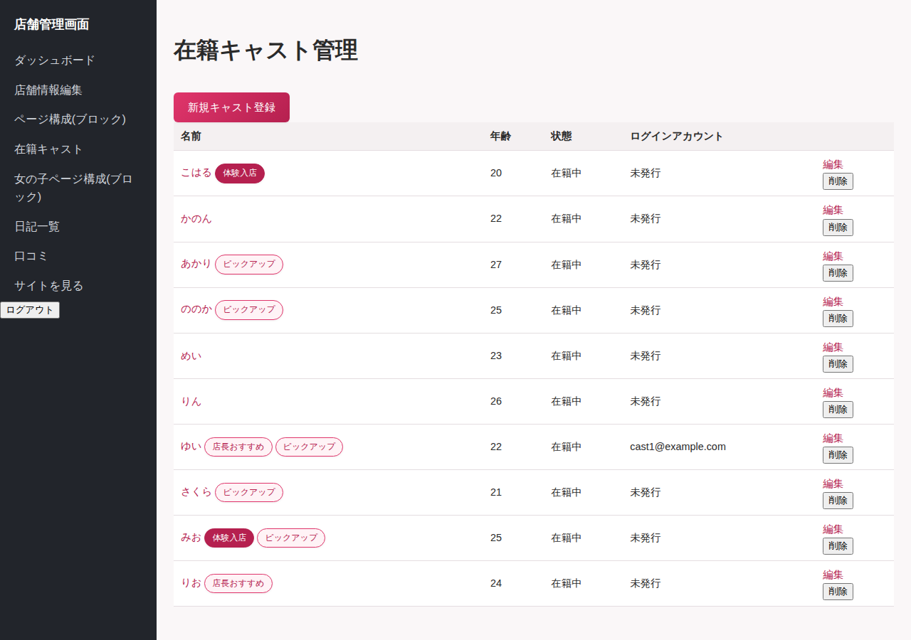
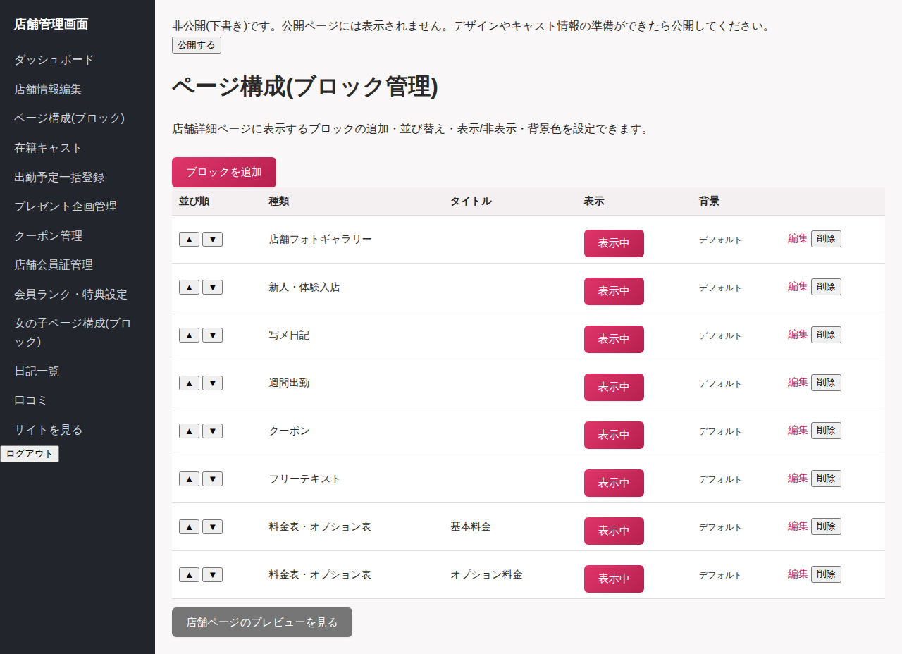
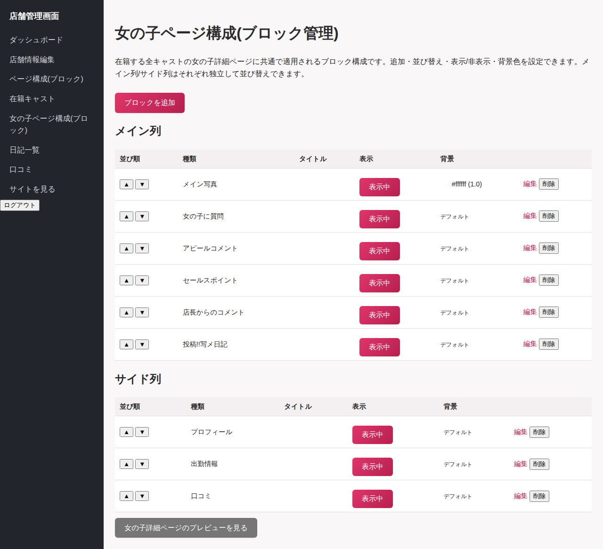
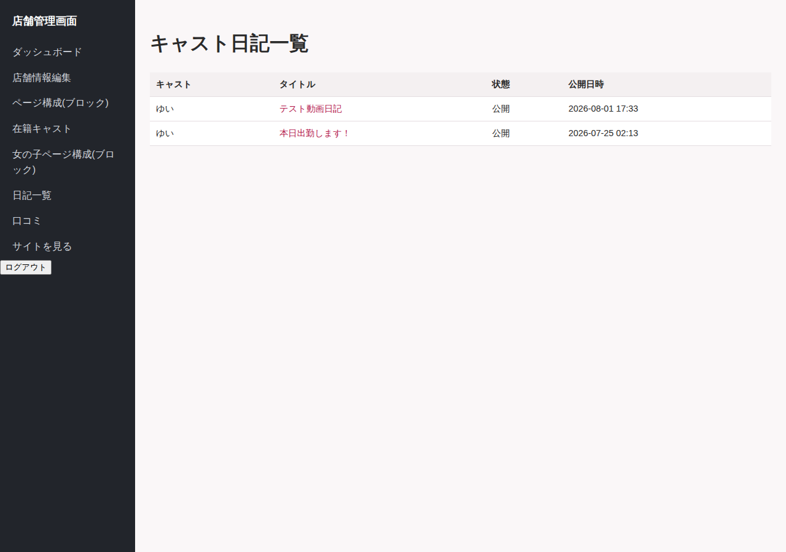
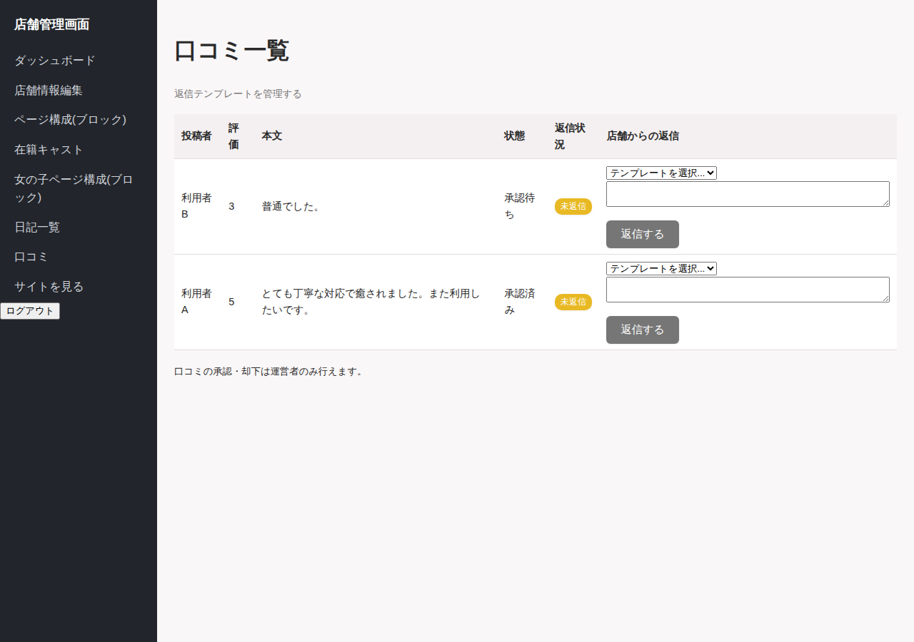
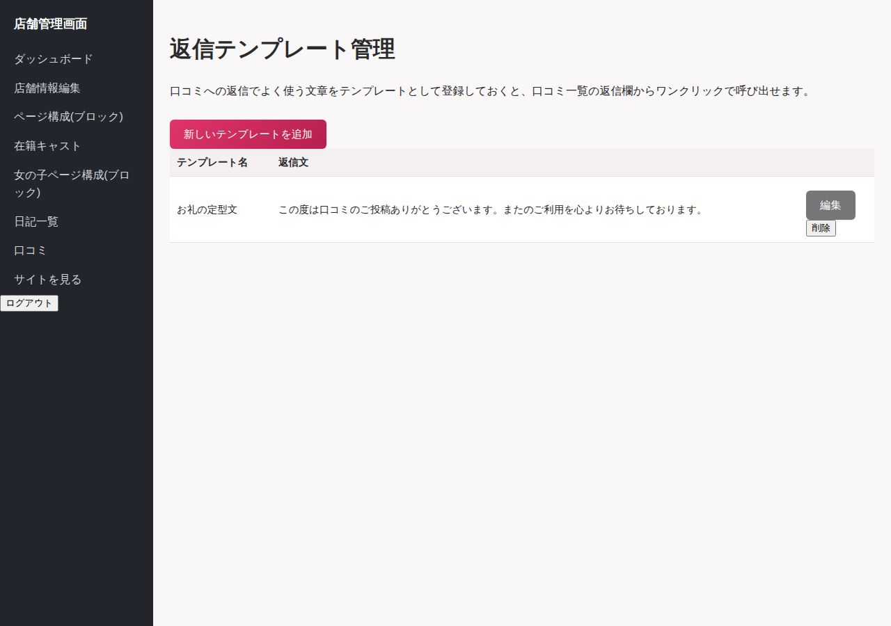

# 店舗管理者マニュアル

対象: `shop_admin` ロールのアカウントをお持ちの店舗管理者向け。
管理画面URL: `/shop_admin`(ログイン後は自動的にこちらへ移動します)

---

## 1. ログイン

`/users/sign_in` からメールアドレスとパスワードでログインしてください。ログイン後、自動的に店舗管理画面(ダッシュボード)が表示されます。

アカウントは運営者、または自店舗の既存の店舗管理者が発行します。アカウント設定リンクが届いた場合は、リンク先で自分のパスワードを設定してください。

---

## 2. ダッシュボード

自店舗の在籍キャスト・最近の口コミのサマリを確認できます。

### 公開状況バナー(すべての画面の上部に表示)

店舗管理画面のどの画面を開いても、画面上部に自店舗の公開状況が表示されます。

- **非公開(下書き)**: 新規開店の準備中や、既存店舗のデザイン・キャスト情報を作り直している間はこの状態にしておくと、公開ページには一切表示されません(検索結果にも出ません)。作業が完了したら「公開する」ボタンを押してください。
- **公開中**: 公開ページに実際に表示されている状態です。デザインを大きく作り直したい場合などは「非公開にする(下書きに戻す)」ボタンで一時的に非公開へ戻せます(すでに来店予約が入っている場合などは、非公開にすると一般のお客様がページを見られなくなる点にご注意ください)。

非公開の間も、店舗ページ・各キャストページの「プレビューを見る」リンクから、公開時と同じ見た目を自分だけ確認できます。プレビューリンクはダッシュボード上部の「店舗ページのデザインをプレビュー」、店舗情報編集画面の「デザインのプレビューを見る」、「ページ構成(ブロック)」画面・「女の子ページ構成(ブロック)」画面の各リンクから開けます。

なお、「公開する」ボタンを押すと、運営者側の店舗管理画面に「デザイン変更あり」という通知が表示されます(運営者が内容を確認するための仕組みで、公開の可否には影響しません)。

**サイトメンテナンス中のプレビューについて**: 運営者がサイト全体をメンテナンスモードにしている間、一般のお客様には案内ページが表示されますが、店舗管理者・運営者としてログインした状態であれば、自店舗の店舗ページ・キャストページのプレビューは通常通り閲覧できます(メンテナンス中でも営業用のデザイン確認・デモは可能です)。

---

## 3. 店舗情報編集(左メニュー「店舗情報編集」)

以下の内容を編集できます。

- キャッチコピー・紹介文・住所・電話番号・営業時間
- 深夜時間の表示形式(24時間表記 / 延長表記)
- 料金の目安・最低料金・交通費・対応エリアのメモ
- クーポン(実施の有無・内容)
- ネット予約対応・来店ポイント制度・イベント開催中フラグ
- コンパニオン募集・スタッフ募集フラグ、募集メッセージ
- 店舗写真(追加方式で最大5枚までアップロード可能。既存の写真は残ったまま追加されます)
- **PRバッジ表示期限**: 日時を指定すると、その日時まで店舗一覧・詳細ページに「PR」バッジが表示されます(自店舗で自由に期間を設定できます。空欄にすると非表示になります)。
- **店舗詳細ページのデザイン**: 一般ユーザー・会員が見る店舗詳細ページの見た目を、サイト標準のデザインから変更できます。
  - **背景色**: ページ全体の背景色
  - **基調文字色**: 見出しや説明文などの基本の文字色
  - **基調色**: ボタン・タグバッジ・リンクなどに使われるアクセントカラー(サイト標準はピンク)
  - **背景画像**: 設定すると背景色より優先して表示されます。削除する場合は編集画面の「現在の背景画像を削除する」にチェックを入れて保存します。
  - いずれも空欄のままにすればサイト標準のデザインのままです。店舗情報・クーポンなど白背景のカード内の文字は、背景色を変えても読みやすいよう常に濃い色で表示されます。
  - 色を変更したら、画面上の「デザインのプレビューを見る」から実際の見た目をすぐに確認できます(保存前の入力内容ではなく、直近に保存した内容が反映されます)。

店舗名・エリア・ジャンル・掲載プランなど、契約に関わる項目は運営者のみが変更できます。変更が必要な場合は運営者にご連絡ください。

クーポンを「実施する」にして内容を入力すると、サイト内のクーポン一覧ページにも自動的に掲載されます。

---

## 4. 在籍キャスト管理(左メニュー「在籍キャスト」)

- **一覧**: 在籍中/退店済みのキャストを確認できます。
- **新規登録**: 源氏名・愛称・年齢・身長・スリーサイズ・カップ・キャッチコピー・紹介文・写真などを入力します。あわせて、そのキャスト本人用のログインアカウント(メールアドレス・パスワード)をその場で発行できます(空欄のままでも登録可能です。その場合キャストは自分でマイページにログインできません)。
- **編集・在籍状態変更**: 退店時は「在籍状態」を退店に変更してください(削除ではなく非表示になります)。
- **削除**: キャスト情報を完全に削除します。

「体験入店」「店長おすすめ」「ピックアップ」のフラグは、店舗ページ上での表示・並び順に影響します。

---

## 5. ページ構成(ブロック)管理(左メニュー「ページ構成(ブロック)」)

店舗詳細ページに表示するブロックの追加・編集・削除・並び替え・表示/非表示を管理します。

利用できるブロックの種類:

| ブロック | 内容 |
|---|---|
| 店舗フォトギャラリー | 店舗写真を並べて表示 |
| 新人・体験入店 | 新人・体験入店中のキャストを表示 |
| 店長おすすめ | 店長おすすめフラグ付きキャストを表示 |
| 写メ日記 | 在籍キャストの写メ日記を一覧表示 |
| 週間出勤 | 直近1週間の出勤予定をタブ切り替えで表示 |
| 口コミランキング | 口コミ評価の高いキャストなどを表示 |
| フリーテキスト | 自由に文章・装飾を入れられるブロック |
| 動画 | 体験動画などを埋め込み表示 |
| クーポン | クーポン情報を表示 |
| 料金表・オプション表 | 料金・オプションの表を作成 |

各ブロックは「▲上に移動」「▼下に移動」「表示/非表示切り替え」ボタンで操作します。背景色・不透明度・見出し文字なども個別に設定できます。

**「料金表・オプション表」ブロックを使って基本料金とオプション料金を分けて見せる方法**

「料金表・オプション表」ブロックは1つにつき1つの表を作りますが、**同じ種類のブロックを複数追加し、それぞれに別のタイトルを付けることで、「基本料金」と「オプション料金」を別々の表として見せることができます**。

1. 「ブロックを追加」から「料金表・オプション表」を選び、タイトルに「基本料金」と入力して、60分・90分・指名料などの項目を登録します。
2. もう一度「ブロックを追加」から「料金表・オプション表」を選び、タイトルに「オプション料金」と入力して、パンスト・ローター・コスプレ・AFなどの項目を登録します。
3. 「▲上に移動」「▼下に移動」で、2つの表の表示順を調整します。

同じ考え方で、エリアごとの交通費表(タイトル「交通費(エリア別)」など)を別ブロックとして追加することもできます。

---

## 6. 女の子ページ構成(ブロック)管理(左メニュー「女の子ページ構成(ブロック)」)

全キャスト共通のキャスト詳細ページのレイアウトを、メインカラム・サイドカラムに分けて管理します。

利用できるブロックの種類: メイン写真、プロフィール、Q&A、アピールコメント、セールスポイント、店長コメント、日記、出勤予定、口コミ、フリーテキスト。

操作方法はページ構成(ブロック)管理と同様です。

---

## 7. 日記閲覧(左メニュー「日記一覧」)

在籍キャスト全員の写メ日記を横断的に閲覧できます(閲覧専用。内容の編集・削除はキャスト本人のみが行えます)。

---

## 8. 口コミ管理(左メニュー「口コミ」)

- 自店舗宛の口コミを一覧で確認できます(承認・却下は運営者のみが行います)。
- 各口コミに返信を投稿・更新できます。
- 「返信テンプレートを管理する」から、よく使う返信文をあらかじめ登録しておけます。返信欄のプルダウンからテンプレートを選ぶと、本文が自動入力されます(選んだ後に自由に編集して投稿できます)。

---

## 9. 出勤予定一括登録(左メニュー「出勤予定一括登録」)

対象キャストの出勤予定をまとめて登録できます。個別の登録・修正は引き続きキャスト本人のマイページ(`/cast/shifts`)で行います。

- **画面で一括登録する**: キャストを1名選び、期間(開始日・終了日)・曜日(チェックボックスで選択)・開始時刻/終了時刻(翌日にまたぐ場合はチェック)・メモを指定すると、期間内でチェックした曜日に該当する日ぶんの出勤予定を一括作成します。
- **CSV一括登録**: 「CSVテンプレートをダウンロード」からひな形を取得し、`キャスト名,勤務日,開始時刻,終了時刻,翌日にまたぐ,メモ` の形式で入力してアップロードしてください。キャスト名は自店舗の在籍キャストの登録名と完全一致している必要があります。
- 一覧画面から個別の出勤予定を削除できます。

---

## 10. プレゼント企画管理(左メニュー「プレゼント企画管理」)

来店者向けのプレゼント抽選企画を作成・運用できます。

- **企画登録**: 企画名・説明・当選人数・応募締切日時を設定します。締切前は店舗ページに企画が表示され、ログイン中の個人会員が応募できます(応募にはSMS認証が必要です。未認証の会員は認証画面に案内されます)。
- **抽選する**: 締切後、企画の詳細画面から「抽選する」を押すと、応募者の中から当選人数ぶんをランダムに抽選し、残りは自動的に落選となります。**一度抽選すると取り消せません。**
- **当落メールを送信する**: 抽選後、「当落メールを送信する」を押すと、まだ通知していない応募者全員に当選・落選メールを一斉送信します(自動送信ではなく、このボタンを押すまで送信されません)。送信済みの応募者には再送されません。

---

## 11. クーポン管理(左メニュー「クーポン管理」)

サイト全体の「クーポンで探す」ページ(`/coupons`)や店舗ページに掲載される、コース単位のクーポンを管理します。

- **登録項目**: クーポンタイトル・コース名・通常料金・割引後料金(通常料金より低い金額のみ登録可)・開始日/終了日(終了日は空欄で無期限)・利用条件・ネット予約限定フラグ。
- 終了日を過ぎた、または開始日前のクーポンは自動的に一覧から非表示になります(削除は不要です)。
- 同じコース名で最も割引後料金が安いクーポンには、サイト全体で自動的に「最安値」バッジが表示されます。
- クーポン一覧の「利用実績」列から、そのクーポンの利用ログを確認できます。公開ページの「ネット予約はこちら」がクリックされると自動的に「ネット予約」として記録され、来店・電話予約など画面外で成立した利用は「来店・電話予約などの利用実績を記録する」ボタンで手動記録できます。

---

## 12. 店舗会員証管理(左メニュー「店舗会員証管理」「会員ランク・特典設定」)

来店回数に応じてランクアップし、来店ごとにポイントが貯まる、店舗独自の会員証機能です。個人会員がSMS認証を済ませたうえで店舗ページから「店舗会員証に登録する」を押すと利用が始まります。

- **会員ランク・特典設定**: 「レギュラー」「ゴールド」のようなランクを、そのランクになる来店回数(◯回以上)とともに登録します。各ランクには複数の特典(割引券・無料券)を設定できます。会員の来店回数がランクの基準に達すると、そのランクに設定した特典が自動的に会員へ付与されます。
- **店舗会員証管理**: 登録済みの会員一覧から、会員ごとの詳細画面に入れます。詳細画面では以下が行えます。
  - **利用履歴の記録**: 来店日・獲得ポイント・メモ(会員にも表示されます)を入力して来店を記録します。記録するとポイントが加算され、ランクの基準に達していれば特典が自動付与されます。
  - **ポイント利用**: 会員が貯めたポイントを使った際、利用ポイント数と内容を入力して記録します。残高を超える利用はできません。
  - **特典の利用済み化**: 付与された割引券・無料券を会員が使用したら、「利用済みにする」ボタンで状態を変更します。
  - **事故歴・注意点の記録**: 店舗スタッフ間で共有したい注意事項を自由記述で残せます。**この内容は会員側には一切表示されません。**
  - 詳細画面には会員のSMS認証状況(認証済み/未認証、認証済みの場合は電話番号)も表示されます。
- 会員が店舗会員証に登録している店舗のページを開くと、ページ上部左寄りに現在のランクと「詳細を見る」リンクが表示されます(ランクは店舗ごとに異なるため、登録している店舗を開いたときのみ表示されます)。
- 詳細画面の一番上には、店舗名・会員名・会員番号(店舗ごとの連番、登録時に自動採番)・発行日(登録日)を重ねて表示するカードイメージがあります。背景画像は会員の会員ランクに設定されたカード画像(未設定の場合はサイト基本設定の会員証イメージ)が使われます。
- 個人会員は自分のマイページから、来店履歴・ポイント履歴・獲得した特典(利用条件を含む)を確認できます。あわせて、その店舗のお気に入り店舗情報・お気に入りの女の子の出勤状況と写メ日記・プレゼント企画の応募状況もまとめて確認できます。事故歴・注意点は表示されません。

---

## 13. 困ったときは

- ログインできない/パスワードを忘れた → 運営者に連絡してパスワードの再設定を依頼してください。
- 店舗名・エリア・ジャンル・プランを変更したい → 運営者にご連絡ください(店舗管理画面からは変更できません)。
